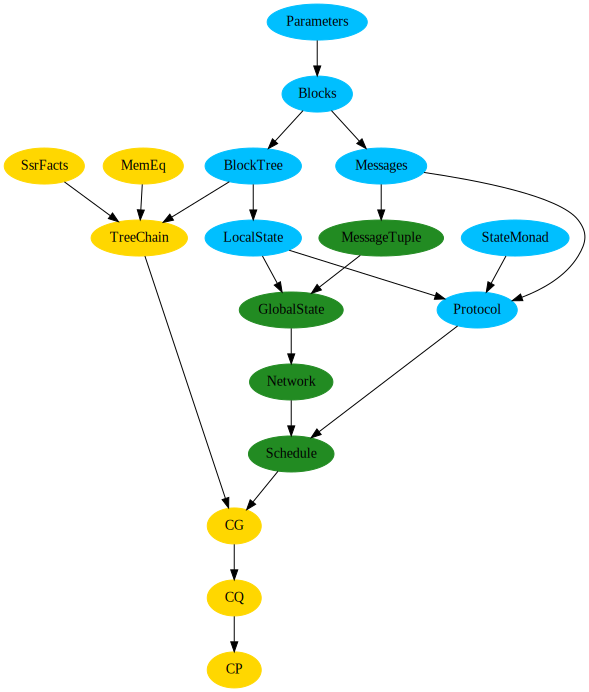

# PoS-NSB
This repository contains a formalization of Proof-of-Stake (PoS)
Nakamoto-style blockchain (NSB). Assuming a synchronous network with a
static set of corrupted parties we prove chain growth, chain quality,
and common prefix.

The report describing the project is available [here](https://arxiv.org/abs/2007.12105).

## Project Structure

The top-level structure consists of the following folders:

* `Protocol` - parameters for the development, implementation of the
  actual protocol and definition of a block tree.
  
* `Model` - definition of the network, global state, and definition of
  reachable global states.

* `Properties` - proved properties about the protocol. `CG.v` contains
  the chain growth theorem, `CQ.v` contains the chain quality theorem,
  and `CP.v` contains the common prefix theorem.

Below is a depiction of the dependencies between the files.



## How to build

### Requirements

* [Coq 8.11.2](https://coq.inria.fr/)
* [Mathematical Components 1.11.0](http://math-comp.github.io/math-comp/) (`ssreflect`)
* [Mathcomp FinMap 1.5.0](https://github.com/math-comp/finmap)
* [Equations 1.2.2](https://github.com/mattam82/Coq-Equations)
* [Coq Record Update 0.2.0](https://github.com/tchajed/coq-record-update)

### Building
The requirements can be installed via [OPAM](https://opam.ocaml.org/doc/Install.html):
```
opam repo add coq-released https://coq.inria.fr/opam/released
opam install coq-mathcomp-ssreflect coq-mathcomp-finmap coq-equations coq-record-update
```

Then, run `make clean; make` from the root folder. This will build all
the libraries and check all the proofs.

